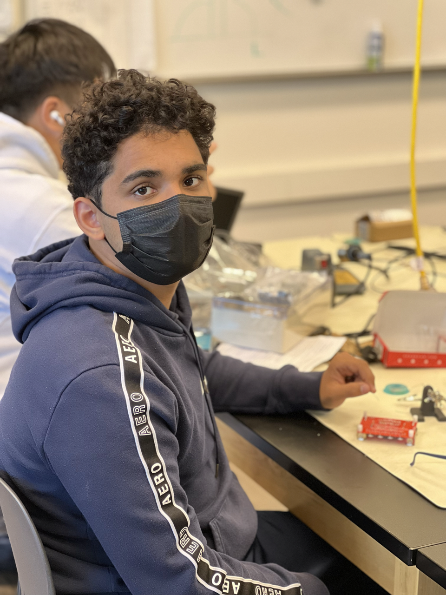

# Keypad and Fingerprint Lock Box
<!--Replace this text with a brief description (2-3 sentences) of your project. This description should draw the reader in and make them interested in what you've built. You can include what the biggest challenges, takeaways, and triumphs from completing the project were. As you complete your portfolio, remember your audience is less familiar than you are with all that your project entails!
-->
For my project, I built the Keypad and Fingerprint Lock box. The project has a keypad and fingerprint sensor attached to a box, and once the correct code and a valid fingerprint are put in, the lock on the inside of the box turns, allowing for user to open it. Once the user puts in or retrieves whatever they need, they can close the box and put in the correct code and fingerprint once again to turn the lock and lock the box.

| **Engineer** | **School** | **Area of Interest** | **Grade** |
|:--:|:--:|:--:|:--:|
| Rushabh T | American High School | Electrical Engineering | Incoming Senior

<!---**Replace the BlueStamp logo below with an image of yourself and your completed project. Follow the guide [here](https://tomcam.github.io/least-github-pages/adding-images-github-pages-site.html) if you need help.**
-->


<!--# Final Milestone

    
          
            
    

          
          Expand Down
    
    
  
For your final milestone, explain the outcome of your project. Key details to include are:
- What you've accomplished since your previous milestone
- What your biggest challenges and triumphs were at BSE
- A summary of key topics you learned about
- What you hope to learn in the future after everything you've learned at BSE
**Don't forget to replace the text below with the embedding for your milestone video. Go to Youtube, click Share -> Embed, and copy and paste the code to replace what's below.**
<iframe width="560" height="315" src="https://www.youtube.com/embed/F7M7imOVGug" title="YouTube video player" frameborder="0" allow="accelerometer; autoplay; clipboard-write; encrypted-media; gyroscope; picture-in-picture; web-share" allowfullscreen></iframe>
# Code
Here's where you'll put your code. The syntax below places it into a block of code. Follow the guide [here]([url](https://www.markdownguide.org/extended-syntax/)) to learn how to customize it to your project needs. 
```c++
void setup() {
  // put your setup code here, to run once:
  Serial.begin(9600);
  Serial.println("Hello World!");
}
void loop() {
  // put your main code here, to run repeatedly:
}
```
-->
# Second Milestone
<!--
For your second milestone, explain what you've worked on since your previous milestone. You can highlight:
- Technical details of what you've accomplished and how they contribute to the final goal
- What has been surprising about the project so far
- Previous challenges you faced that you overcame
- What needs to be completed before your final milestone 
-->
<iframe width="560" height="315" src="https://www.youtube.com/embed/ojStgfp3zzo" title="YouTube video player" frameborder="0" allow="accelerometer; autoplay; clipboard-write; encrypted-media; gyroscope; picture-in-picture; web-share" allowfullscreen></iframe>
For my second milestone, I have added a fingerprint sensor and battery to my project. This allows the setup to be no longer reliant on my computer as a power source meaning it can be connected to the box. The fingerprint sensor allows the user to scan their fingerprint as another form of verification as well as a way for the user to see if their inputs are right or wrong. The led on the sensor turns red if either the fingerprint or code is incorrect while turning blue if both are correct. The servo works with both, turning if both inputs are correct. A challenge I faced during this milestone was attaching the fingerprint sensor and getting it to work. There were 6 wires attached to the sensor but only 4 were being used, leaving me confused about the purpose of the other 2 until I realized they were useless. Coding it to work was also a struggle as I was not sure what function I was supposed to be used to compare the users fingerprint to the fingerprints of the library until I realized I had to call the entire method and not specific functions. Another issue I faced was running out of space on the Arduino board to plug in the components, but that was easily solved with a breadboard. The next steps will be to add a way to change the passcode, a way to add and remove fingerprints from the library and attach the whole thing to the box. 
 
# Code

    

```
c++
#include <Keypad.h>
#include <Servo.h>
#include <Adafruit_Fingerprint.h>
#if (defined(__AVR__) || defined(ESP8266)) && !defined(__AVR_ATmega2560__)
// For UNO and others without hardware serial, we must use software serial...
// pin #12 is IN from sensor (GREEN wire)
// pin #13 is OUT from arduino  (WHITE wire)
// Set up the serial port to use softwareserial..
SoftwareSerial mySerial(12, 13);
#else
// On Leonardo/M0/etc, others with hardware serial, use hardware serial!
// #0 is green wire, #1 is white
#define mySerial Serial1
#endif
const byte ROWS = 4;  //four rows
const byte COLS = 3;  //three columns
String password = "1234";
String code = "";
String input = "";
Servo myservo;
Adafruit_Fingerprint finger = Adafruit_Fingerprint(&mySerial);
uint8_t id;
int pos = 0;
char keys[ROWS][COLS] = {
  { '1', '2', '3' },
  { '4', '5', '6' },
  { '7', '8', '9' },
  { '*', '0', '#' }
};
byte rowPins[ROWS] = { 6, 7, 8, 9 };  //connect to the row pinouts of the keypad
byte colPins[COLS] = { 3, 4, 5 };     //connect to the column pinouts of the keypad
//Create an object of keypad
Keypad keypad = Keypad(makeKeymap(keys), rowPins, colPins, ROWS, COLS);
void setup() {
  Serial.begin(9600);
  myservo.attach(11);  // attaches the servo on pin 11 to the servo object
  myservo.write(pos);
  //while (!Serial)
  ;  // For Yun/Leo/Micro/Zero/...
  delay(100);
  Serial.println("\n\nAdafruit Fingerprint sensor enrollment");
  // set the data rate for the sensor serial port
  finger.begin(57600);
  if (finger.verifyPassword()) {
    Serial.println("Found fingerprint sensor!");
  } else {
    Serial.println("Did not find fingerprint sensor :(");
    while (1) { delay(1); }
  }
  // Serial.println("Ready to enroll a fingerprint!");
  // Serial.println("Please type in the ID # (from 1 to 127) you want to save this finger as...");
  //  id = int(keypad.getKey());
  // id = readnumber();
  // Serial.println(id);
  // if (id == 0) {  // ID #0 not allowed, try again!
  //   return;
  // }
  // Serial.print("Enrolling ID #");
  // Serial.println(id);
  // while (!getFingerprintEnroll());
  finger.getTemplateCount();
  if (finger.templateCount == 0) {
    Serial.print("Sensor doesn't contain any fingerprint data. Please run the 'enroll' example.");
  } else {
    Serial.println("Waiting for valid finger...");
    Serial.print("Sensor contains ");
    Serial.print(finger.templateCount);
    Serial.println(" templates");
  }
}
uint8_t readnumber(void) {
  uint8_t num = 0;
  while (num == 0) {
    while (!Serial.available())
      ;
    num = Serial.parseInt();
  }
  return num;
}
//loop
void loop() {
  char key = keypad.getKey();  // Read the key
  if (key == '*') {
    input = "";
    code = "";
    Serial.println("cleared");
  }
  else if (key == '#') {
    if (password == input) {
      finger.LEDcontrol(FINGERPRINT_LED_GRADUAL_ON, 0, FINGERPRINT_LED_PURPLE);
      Serial.println("put finger on sensor");
      delay(2000);
      finger.LEDcontrol(FINGERPRINT_LED_GRADUAL_OFF, 0, FINGERPRINT_LED_PURPLE);
      if (getFingerprintID() == 1) {
        Serial.println("Unlocked");
        finger.LEDcontrol(FINGERPRINT_LED_GRADUAL_ON, 0, FINGERPRINT_LED_BLUE);
        input = "";
        code = "";
        if (pos == 0) {
          for (pos = 0; pos < 90; pos += 3) {  // goes from 0 degrees to 180 degrees
            // in steps of 1 degree
            myservo.write(pos);  // tell servo to go to position in variable 'pos'
            delay(15);           // waits 15ms for the servo to reach the position
          }
        } else if (pos == 90) {
          for (pos = 90; pos > 0; pos -= 3) {  // goes from 0 degrees to 180 degrees
            // in steps of 1 degree
            myservo.write(pos);  // tell servo to go to position in variable 'pos'
            delay(15);           // waits 15ms for the servo to reach the position
          }
        }
        delay(2500);
        finger.LEDcontrol(FINGERPRINT_LED_GRADUAL_OFF, 0, FINGERPRINT_LED_BLUE);
      } else {
        Serial.println("Don't recognize finerprint");
        finger.LEDcontrol(FINGERPRINT_LED_GRADUAL_ON, 1, FINGERPRINT_LED_RED, 50);
        delay(2500);
        finger.LEDcontrol(FINGERPRINT_LED_GRADUAL_OFF, 0, FINGERPRINT_LED_RED);
        input = "";
        code = "";
      }
    } else {
      Serial.println("Wrong password");
      finger.LEDcontrol(FINGERPRINT_LED_GRADUAL_ON, 1, FINGERPRINT_LED_RED, 50);
      delay(2500);
      finger.LEDcontrol(FINGERPRINT_LED_GRADUAL_OFF, 0, FINGERPRINT_LED_RED);
      input = "";
      code = "";
    }
  }
  // Print if key pressed
  else if (key) {
    code = code + "*";
    input += key;
    Serial.println(code);
  }
}
uint8_t getFingerprintEnroll() {
  int p = -1;
  Serial.print("Waiting for valid finger to enroll as #");
  Serial.println(id);
  while (p != FINGERPRINT_OK) {
    p = finger.getImage();
    switch (p) {
      case FINGERPRINT_OK:
        Serial.println("Image taken");
        break;
      case FINGERPRINT_NOFINGER:
        Serial.print(".");
        break;
      case FINGERPRINT_PACKETRECIEVEERR:
        Serial.println("Communication error");
        break;
      case FINGERPRINT_IMAGEFAIL:
        Serial.println("Imaging error");
        break;
      default:
        Serial.println("Unknown error");
        break;
    }
  }
  // OK success!
  p = finger.image2Tz(1);
  switch (p) {
    case FINGERPRINT_OK:
      Serial.println("Image converted");
      break;
    case FINGERPRINT_IMAGEMESS:
      Serial.println("Image too messy");
      return p;
    case FINGERPRINT_PACKETRECIEVEERR:
      Serial.println("Communication error");
      return p;
    case FINGERPRINT_FEATUREFAIL:
      Serial.println("Could not find fingerprint features");
      return p;
    case FINGERPRINT_INVALIDIMAGE:
      Serial.println("Could not find fingerprint features");
      return p;
    default:
      Serial.println("Unknown error");
      return p;
  }
  Serial.println("Remove finger");
  delay(2000);
  p = 0;
  while (p != FINGERPRINT_NOFINGER) {
    p = finger.getImage();
  }
  Serial.print("ID ");
  Serial.println(id);
  p = -1;
  Serial.println("Place same finger again");
  while (p != FINGERPRINT_OK) {
    p = finger.getImage();
    switch (p) {
      case FINGERPRINT_OK:
        Serial.println("Image taken");
        break;
      case FINGERPRINT_NOFINGER:
        Serial.print(".");
        break;
      case FINGERPRINT_PACKETRECIEVEERR:
        Serial.println("Communication error");
        break;
      case FINGERPRINT_IMAGEFAIL:
        Serial.println("Imaging error");
        break;
      default:
        Serial.println("Unknown error");
        break;
    }
  }
  // OK success!
  p = finger.image2Tz(2);
  switch (p) {
    case FINGERPRINT_OK:
      Serial.println("Image converted");
      break;
    case FINGERPRINT_IMAGEMESS:
      Serial.println("Image too messy");
      return p;
    case FINGERPRINT_PACKETRECIEVEERR:
      Serial.println("Communication error");
      return p;
    case FINGERPRINT_FEATUREFAIL:
      Serial.println("Could not find fingerprint features");
      return p;
    case FINGERPRINT_INVALIDIMAGE:
      Serial.println("Could not find fingerprint features");
      return p;
    default:
      Serial.println("Unknown error");
      return p;
  }
  // OK converted!
  Serial.print("Creating model for #");
  Serial.println(id);
  p = finger.createModel();
  if (p == FINGERPRINT_OK) {
    Serial.println("Prints matched!");
  } else if (p == FINGERPRINT_PACKETRECIEVEERR) {
    Serial.println("Communication error");
    return p;
  } else if (p == FINGERPRINT_ENROLLMISMATCH) {
    Serial.println("Fingerprints did not match");
    return p;
  } else {
    Serial.println("Unknown error");
    return p;
  }
  Serial.print("ID ");
  Serial.println(id);
  p = finger.storeModel(id);
  if (p == FINGERPRINT_OK) {
    Serial.println("Stored!");
  } else if (p == FINGERPRINT_PACKETRECIEVEERR) {
    Serial.println("Communication error");
    return p;
  } else if (p == FINGERPRINT_BADLOCATION) {
    Serial.println("Could not store in that location");
    return p;
  } else if (p == FINGERPRINT_FLASHERR) {
    Serial.println("Error writing to flash");
    return p;
  } else {
    Serial.println("Unknown error");
    return p;
  }
  return true;
}
uint8_t getFingerprintID() {
  uint8_t p = finger.getImage();
  switch (p) {
    case FINGERPRINT_OK:
      Serial.println("Image taken");
      break;
    case FINGERPRINT_NOFINGER:
      Serial.println("No finger detected");
      return p;
    case FINGERPRINT_PACKETRECIEVEERR:
      Serial.println("Communication error");
      return p;
    case FINGERPRINT_IMAGEFAIL:
      Serial.println("Imaging error");
      return p;
    default:
      Serial.println("Unknown error");
      return p;
  }
  // OK success!
  p = finger.image2Tz();
  switch (p) {
    case FINGERPRINT_OK:
      Serial.println("Image converted");
      break;
    case FINGERPRINT_IMAGEMESS:
      Serial.println("Image too messy");
      return p;
    case FINGERPRINT_PACKETRECIEVEERR:
      Serial.println("Communication error");
      return p;
    case FINGERPRINT_FEATUREFAIL:
      Serial.println("Could not find fingerprint features");
      return p;
    case FINGERPRINT_INVALIDIMAGE:
      Serial.println("Could not find fingerprint features");
      return p;
    default:
      Serial.println("Unknown error");
      return p;
  }
  // OK converted!
  p = finger.fingerSearch();
  if (p == FINGERPRINT_OK) {
    Serial.println("Found a print match!");
    return 1;
  } else if (p == FINGERPRINT_PACKETRECIEVEERR) {
    Serial.println("Communication error");
    return p;
  } else if (p == FINGERPRINT_NOTFOUND) {
    Serial.println("Did not find a match");
    return p;
  } else {
    Serial.println("Unknown error");
    return p;
  }
  // found a match!
  Serial.print("Found ID #");
  Serial.print(finger.fingerID);
  Serial.print(" with confidence of ");
  Serial.println(finger.confidence);
  return finger.fingerID;
}
```


# First Milestone
<!--For your first milestone, describe what your project is and how you plan to build it. You can include:
- An explanation about the different components of your project and how they will all integrate together
- Technical progress you've made so far
- Challenges you're facing and solving in your future milestones
- What your plan is to complete your project-->
<iframe width="560" height="315" src="https://www.youtube.com/embed/e8Pgml_ho5w" title="YouTube video player" frameborder="0" allow="accelerometer; autoplay; clipboard-write; encrypted-media; gyroscope; picture-in-picture; web-share" allowfullscreen></iframe>
For my first milestone, I attached a functioning keypad and a servo and set a passcode to activate them. This is the first security system and the locking system that I plan to use, leaving only the fingerprint sensor and the installation in the box. I used jumper cables to connect the servo and number pad to the Arduino board. I used C++ to create a matrix that matched every key on the keyboard to provide an output representing the same number when the respective key was pressed. This allowed for a user to input values which were later used to make a code to compare with the password. The only exceptions to this were "*" and "#" which cleared the code and compared it with the password respectively. I then added the servo to function as part of a locking system. When the proper code was put in, the servo would turn 90° which would be used to either lock or unlock the box.
# Code

```
c++
#include <Keypad.h>
#include <Servo.h>
const byte ROWS = 4;  //four rows
const byte COLS = 3;  //three columns
String password = "1234";
String code = "";
String input = "";
Servo myservo;
int pos = 90;
char keys[ROWS][COLS] = {
  { '1', '2', '3' },
  { '4', '5', '6' },
  { '7', '8', '9' },
  { '*', '0', '#' }
};
byte rowPins[ROWS] = { 6, 7, 8, 9 };  //connect to the row pinouts of the keypad
byte colPins[COLS] = { 3, 4, 5 };     //connect to the column pinouts of the keypad
//Create an object of keypad
Keypad keypad = Keypad(makeKeymap(keys), rowPins, colPins, ROWS, COLS);
void setup() {
  Serial.begin(9600);
  myservo.attach(11);  // attaches the servo on pin 11 to the servo object
  myservo.write(pos);
}
void loop() {
  char key = keypad.getKey();  // Read the key
  if (key == '*') {
    input = "";
    code = "";
    Serial.println("cleared");
  }
  else if (key == '#') {
    if (password == input) {
      Serial.println("Unlocked");
      input = "";
      code = "";
      if(pos==0){
        for (pos = 0; pos < 90; pos += 3) {  // goes from 0 degrees to 180 degrees
          // in steps of 1 degree
          myservo.write(pos);  // tell servo to go to position in variable 'pos'
          delay(15);           // waits 15ms for the servo to reach the position
        }
      }
      else if (pos==90){
        for (pos = 90; pos > 0; pos -= 3) {  // goes from 0 degrees to 180 degrees
          // in steps of 1 degree
          myservo.write(pos);  // tell servo to go to position in variable 'pos'
          delay(15);           // waits 15ms for the servo to reach the position
        }
      }
      }
     else {
      Serial.println("Wrong password");
      input = "";
      code = "";
    }
  }
  // Print if key pressed
  else if (key) {
    code = code + "*";
    input += key;
    Serial.println(code);
  }
}
```

# Starter Project 
<!--For your first milestone, describe what your project is and how you plan to build it. You can include:
- An explanation about the different components of your project and how they will all integrate together
- Technical progress you've made so far
- Challenges you're facing and solving in your future milestones
- What your plan is to complete your project-->
<iframe width="560" height="315" src="https://www.youtube.com/embed/jMDJ2qqvpEo" title="YouTube video player" frameborder="0" allow="accelerometer; autoplay; clipboard-write; encrypted-media; gyroscope; picture-in-picture; web-share" allowfullscreen></iframe>
For my starter, I made the Binary Blaster. The binary blaster displays numbers from 1 to 15 in base 10 in a random , and the user needs to put in the corresponding values in binary. The 4 buttons on the binary blaster represent the first, second, third, and fourth bit in binary. A pressed button represents the bit being 1 and non pressed represents the bit being 0. If the user does not get the correct input within 6 seconds, the game ends and the user can restart. After 15 correct inputs, then the user gets the time they took to solve it and can restart. While waiting for the user to start, the game cycles through the numbers and shows the corresponding binary input by lighting up the buttons on the bottom.
<!--# Schematics 
Here's where you'll put images of your schematics. [Tinkercad](https://www.tinkercad.com/blog/official-guide-to-tinkercad-circuits) and [Fritzing](https://fritzing.org/learning/) are both great resources to create professional schematic diagrams, though BSE recommends Tinkercad because it can be done easily and for free in the browser. 
-->
# Bill of Materials
<!--Here's where you'll list the parts of your project. To add more rows, just copy and paste the example rows below.
Don't forget to place the link of where to buy each component inside the quotation marks in the corresponding row after href =. Follow the guide [here]([url](https://www.markdownguide.org/extended-syntax/)) to learn how to customize this to your project needs. -->

| **Part** | **Note** | **Price** | **Link** |
|:--:|:--:|:--:|:--:|
| Arduino Board | Used to store code as well as input and output pins to send and receive signals. | $27.95 | <a href="https://www.amazon.com/Arduino-A000066-ARDUINO-UNO-R3/dp/B008GRTSV6/"> Link </a> |
| Keypad | Used to input a code| $11.95 | <a href="https://www.amazon.com/Adafruit-3x4-Phone-style-Matrix-Keypad/dp/B00QSHPCO8/ref=asc_df_B00QSHPCO8/?tag=hyprod-20&linkCode=df0&hvadid=642063549738&hvpos=&hvnetw=g&hvrand=6586475367768961937&hvpone=&hvptwo=&hvqmt=&hvdev=c&hvdvcmdl=&hvlocint=&hvlocphy=9032183&hvtargid=pla-1932365220176&psc=1&gclid=Cj0KCQjwtO-kBhDIARIsAL6LoreDws-fQrbUv8j4FzonZWjF67U0_QuT88VK3-7rFQHX-f-Ga8-MS74aAjhkEALw_wcB"> Link </a> |
| Servo | Turns to act like a lock | $10.00 | <a href="https://www.amazon.com/MMOBIEL-Airplane-Helicopter-Compatible-Raspberry/dp/B09BZTRSDP/ref=asc_df_B09BZTRSDP/?tag=hyprod-20&linkCode=df0&hvadid=632109977210&hvpos=&hvnetw=g&hvrand=17319493360633244579&hvpone=&hvptwo=&hvqmt=&hvdev=c&hvdvcmdl=&hvlocint=&hvlocphy=9032183&hvtargid=pla-1510127627453&psc=1"> Link </a> |
| Jumper Wires | Connects components to Arduino board | $4.61 | <a href="https://www.amazon.com/120pcs-Dupont-Ribbon-Breadboard-arduino/dp/B07KLM9KR1/ref=asc_df_B07KLM9KR1/?tag=hyprod-20&linkCode=df0&hvadid=642170509892&hvpos=&hvnetw=g&hvrand=11961711466041498963&hvpone=&hvptwo=&hvqmt=&hvdev=c&hvdvcmdl=&hvlocint=&hvlocphy=9032183&hvtargid=pla-1954692578081&psc=1&gclid=Cj0KCQjwtO-kBhDIARIsAL6Lorc8F8WBt8xSeZC6phf1oQMX6W9EtIKvnW-9HtXrfy9yawGwdlva4nEaAp7cEALw_wcB"> Link </a> |
| Fingerprint Sensor | Scans users fingerprints | $25.47 | <a href="https://www.amazon.com/Fingerprint-Identification-Capacitive-Recognition-Assistance/dp/B08GKY4RK1/ref=asc_df_B08GKY4RK1/?tag=hyprod-20&linkCode=df0&hvadid=658824471335&hvpos=&hvnetw=g&hvrand=5390830515971170324&hvpone=&hvptwo=&hvqmt=&hvdev=c&hvdvcmdl=&hvlocint=&hvlocphy=9032183&hvtargid=pla-2071100511245&psc=1&gclid=Cj0KCQjwtO-kBhDIARIsAL6Lorc17L5Nd2v9Ny0N6K_8U5f5FNkOVYYsj_PL7KQY3tWn0g1qUpU-6a0aArFrEALw_wcB"> Link </a> |
| Breadboard| Used to hold cables| $8.75 | <a href="https://www.amazon.com/BB830-Solderless-Plug-BreadBoard-tie-Points/dp/B0040Z4QN8/ref=asc_df_B0040Z4QN8/?tag=hyprod-20&linkCode=df0&hvadid=312400581241&hvpos=&hvnetw=g&hvrand=13618660822161177333&hvpone=&hvptwo=&hvqmt=&hvdev=c&hvdvcmdl=&hvlocint=&hvlocphy=9032183&hvtargid=pla-420088669616&psc=1"> Link </a> |
| LCD display| Shows messages to users | $12.89 | <a href="https://www.amazon.com/SunFounder-Serial-Module-Arduino-Mega2560/dp/B01GPUMP9C/ref=asc_df_B01GPUMP9C/?tag=&linkCode=df0&hvadid=309777534894&hvpos=&hvnetw=g&hvrand=3916194996455184178&hvpone=&hvptwo=&hvqmt=&hvdev=c&hvdvcmdl=&hvlocint=&hvlocphy=9032183&hvtargid=pla-572925702212&ref=&adgrpid=58425267301&th=1"> Link </a> |
| 5 Battery Pack | Holds batteries| $3.95 | <a href="https://www.adafruit.com/product/3456?gclid=Cj0KCQjwtO-kBhDIARIsAL6LordZ3h7CNFbAxJyze__4-npcjz4h56lQhREUP4SY0d9Tb1PrckVoAcIaArUyEALw_wcB"> Link </a> |
| Batteries | Provide an energy source. to the Arduino board | $6.23 | <a href="https://www.amazon.com/AmazonBasics-Performance-Alkaline-Batteries-8-Pack/dp/B00O869QUC/ref=asc_df_B00O869QUC/?tag=hyprod-20&linkCode=df0&hvadid=563645139568&hvpos=&hvnetw=g&hvrand=5406759330328739186&hvpone=&hvptwo=&hvqmt=&hvdev=c&hvdvcmdl=&hvlocint=&hvlocphy=9032183&hvtargid=pla-332122495633&psc=1"> Link </a> |


<!--
# Other Resources/Examples
One of the best parts about Github is that you can view how other people set up their own work. Here are some past BSE portfolios that are awesome examples. You can view how they set up their portfolio, and you can view their index.md files to understand how they implemented different portfolio components.
- [Example 1](https://trashytuber.github.io/YimingJiaBlueStamp/)
- [Example 2](https://sviatil0.github.io/Sviatoslav_BSE/)
- [Example 3](https://arneshkumar.github.io/arneshbluestamp/)
To watch the BSE tutorial on how to create a portfolio, click here.
-->
